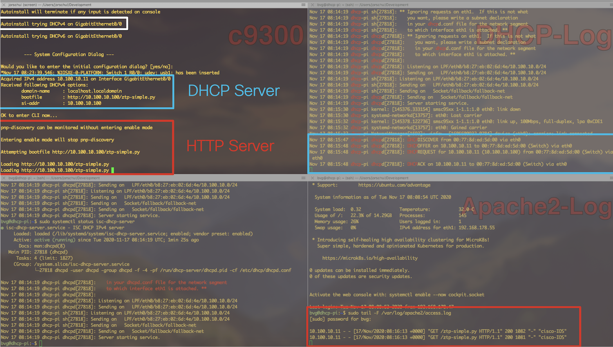

# Technical Documentation: ZTP2GO: Zero Touch Provisioning with Cisco IOS XE and Raspberry Pi

Easily provision Cisco IOS XE based networking devices on the go with a raspberry pi.

When deploying a fresh or resetted Catalyst 9000 switch, it can be easily provisioned on the go by connecting a raspberry Pi (Ubuntu Server, ISC DHCP Server, Apache/Nginx Webserver).

During the boot process of the switch, the DHCP server gives the switch the location of the ZTP python script (located on the webserver). Then the switch loads the file and executes all the defined configuration commands for provisioning.


* Watch Demo Video: https://www.youtube.com/watch?v=Ig-HeN_HyfQ
* ZTP Repo: https://github.com/jeremycohoe/c9300-ztp

## Configuration Steps

This will help you to setup this environment in your lab.

### 1. Configuration of the local network (e.g. eth0) = Ethernet port of RasPi

`sudo vim /etc/netplan/01-network-manager-all.yaml`

Example config:

```
network:
  version: 2
  renderer: networkd
  ethernets:
    eth0:
      addresses: [10.100.10.100/24]
      dhcp4: no
      gateway4: 10.100.10.1
    eth1:
      dhcp4: true
```

### 2. Install ISC DHCP-Server on the Raspberry Pi

```
sudo apt install isc-dhcp-server

sudo systemctl status isc-dhcp-server

sudo vim /etc/dhcp/dhcpd.conf
```

Add the following lines to the dhcpd.conf and modify the the subnet to your local enviroment:

```
option domain-name "localhost.localdomain";
default-lease-time 600;
max-lease-time 7200;
ddns-update-style none;
#option ip-tftp-server code 150 = { ip-address };
authoritative;
# DHCP range for ZTP on C9300
subnet 10.100.10.0 netmask 255.255.255.0 {
	range 10.100.10.10 10.100.10.15;
	option domain-name "localhost.localdomain";
	option subnet-mask 255.255.255.0;
	option broadcast-address 10.100.10.255;
	default-lease-time 600;
	max-lease-time 7200;
	option bootfile-name "http://10.100.10.100/ztp-simple.py";
}
```
### 3. Install Webmin for smooth configuration of Ubuntu Server 20.04 on Raspberry Pi (optional)

We recommend to use the graphical tool [Webmin](https://www.webmin.com/) for managing.

```
sudo apt install webmin

sudo apt-get install perl libnet-ssleay-perl openssl libauthen-pam-perl libpam-runtime libio-pty-perl apt-show-versions python unzip

wget http://prdownloads.sourceforge.net/webadmin/webmin_1.970_all.deb

sudo dpkg --install webmin_1.970_all.deb
```

### 4. Prepare Python Files

We based our ZTP script on the scripts of [Jeremy Cohoe's c9300-ztp](https://github.com/jeremycohoe/c9300-ztp). Feel free to modify the commands to your needs. You can find our simplified version in this repo: `ztp-homelab.py`

```
sudo apt install git
git clone https://github.com/jeremycohoe/c9300-ztp
```

### 5. Setup Webserver

We need to setup a webserver from where the switch can pull the python file.

We used Apache: `sudo apt install apache2`

Then, copy your ZTP Python script to the webserver access folder:

`sudo cp ztp-simple.py /var/www/html/ztp-simple.py`

Check if you can load the Python file with any connected browser.

### 6. Start Process

Now you are ready to start the process. At first start the raspberry pi + services, connect to the switch and then boot the switch:



Some helpful commands:

```
# Webmin DHCP GUI
https://dhcp-pi:10000/

# DHCP logging command
sudo tail -F /var/log/syslog |grep -i dhcp

# Apache2 looging command (tail)
sudo tail -F /var/log/apache2/access.log
```

## Contributors

* **Joerg Schultz** - [jorschul](https://github.com/jorschul)
* **Florian Pachinger** - [flopach](https://github.com/flopach)

## License

This project is licensed under GPL3 - see the [LICENSE.md](LICENSE.md) file for details