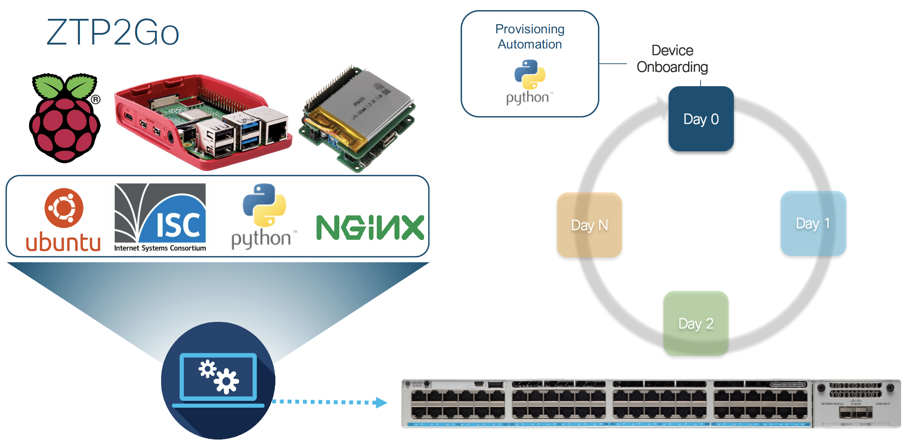

ZTP2GO: Zero Touch Provisioning with Cisco IOS XE and Raspberry Pi
=====================================
Easily provision Cisco IOS XE based networking devices on the go with a Raspberry Pi.

When deploying a fresh or resetted Catalyst 9000 switch, it can be easily provisioned on the go by connecting a raspberry Pi (Ubuntu Server, ISC DHCP Server, Apache/Nginx Webserver).

During the boot process of the switch, the DHCP server gives the switch the location of the ZTP python script (located on the webserver). Then the switch loads the file and executes all the defined configuration commands for provisioning.

## Demo Video
Watch Demo Video: https://www.youtube.com/watch?v=Ig-HeN_HyfQ

## Related Sandbox

[IOS XE on CSR Latest Code with ZTP functionality](https://devnetsandbox.cisco.com/RM/Diagram/Index/f2e2c0ad-844f-4a73-8085-00b5b28347a1?diagramType=Topology)

## Links to DevNet Learning Labs
[Getting Started with Zero Touch Provisioning on IOS-XE)](https://developer.cisco.com/learning/lab/LL-ZTP-XE/step/1)
